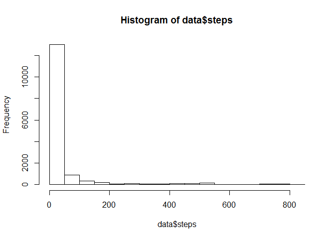
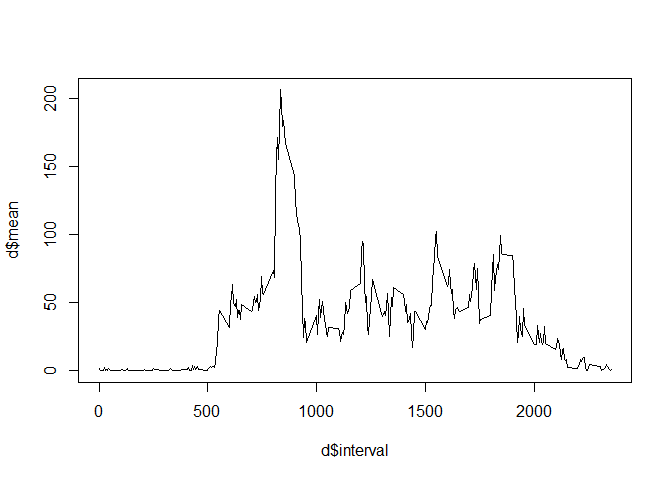
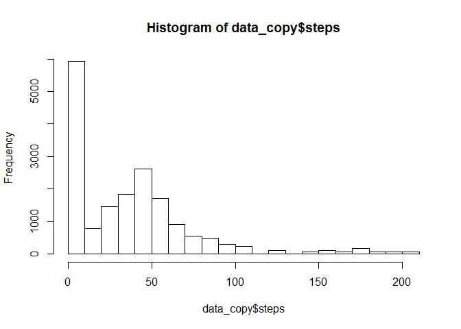
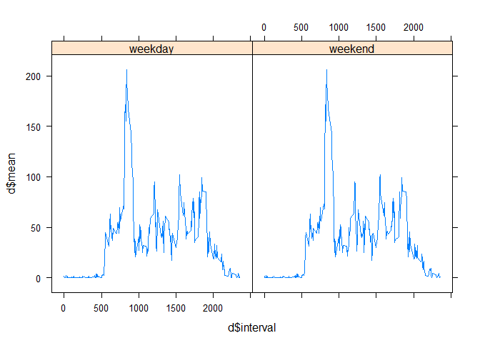

# Reproducible Research: Peer Assessment 1


## Loading and preprocessing the data

```r
setwd("C:/Users/Max/Desktop/Coursera/Reproducible Research/PA2/RepData_PeerAssessment1")
unzip("activity.zip")
data <- read.csv("activity.csv")
```

## What is mean total number of steps taken per day?

```r
hist(data$steps)
```

 

```r
mean = mean(data$steps, na.rm = T)
median = median(data$steps, na.rm = T)
```
Mean and median total number of steps taken per day are 37.3825996 and 0 accordingly.

## What is the average daily activity pattern?

```r
#install.packages("plyr")
library("plyr")
d <- ddply(data, ~interval, summarise, mean = mean(steps, na.rm = T))
plot(d$interval, d$mean, type = "l")
```

 

```r
idx = which.max(d$mean)
int = d$interval[idx]
```
On average across all the days in the dataset, the 5-minute interval 835, contains the maximum number of steps.

## Imputing missing values

```r
data_copy = data
com = sum(complete.cases(data))
for (i in d$interval) {
    data_copy$steps[data_copy$interval == i] <- d$mean[d$interval == i]
}
hist(data_copy$steps)
```

 

```r
mean = mean(data_copy$steps, na.rm = T)
median = median(data_copy$steps, na.rm = T)
```

* The number of complete cases is 15264
* Current mean and median total number of steps taken per day are 37.3825996 and 34.1132075 accordingly.
* The mean value is remain unchanged while the median increased.
* The impact of imputing missing data on the estimates of the total daily number of steps is increased median.

## Are there differences in activity patterns between weekdays and weekends?

```r
#install.packages("lattice")
library("lattice")
data_copy$weekdays <- weekdays(as.Date(data_copy$date, format="%Y-%m-%d"))
data_copy$weekend <- "weekday"
data_copy$weekend[data_copy$weekdays == "Saturday" | data_copy$weekdays == "Sunday"] <- "weekend"
data_copy$weekend <- factor(data_copy$weekend)
d <- ddply(data_copy, ~ weekend + interval, summarise, mean = mean(steps, na.rm = T))
xyplot(d$mean ~ d$interval|d$weekend, t = "l", auto.key=list(space="top", columns = 1, title = "Steps", cex.title = 1, lines = TRUE, points = FALSE))
```

 


